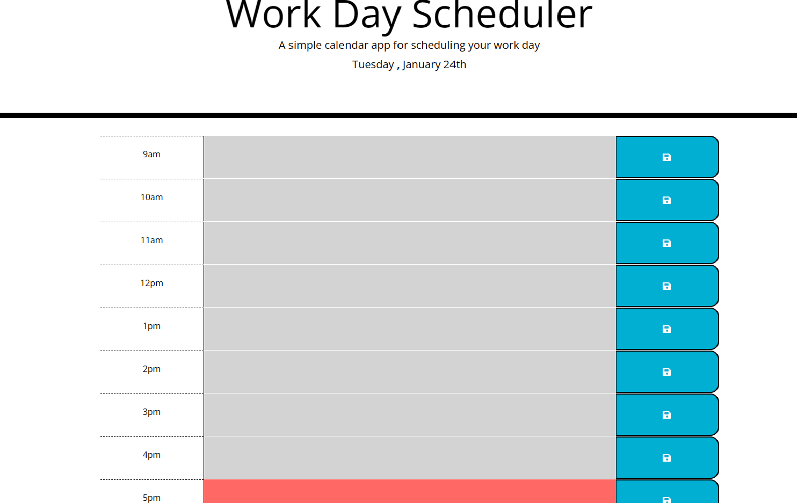
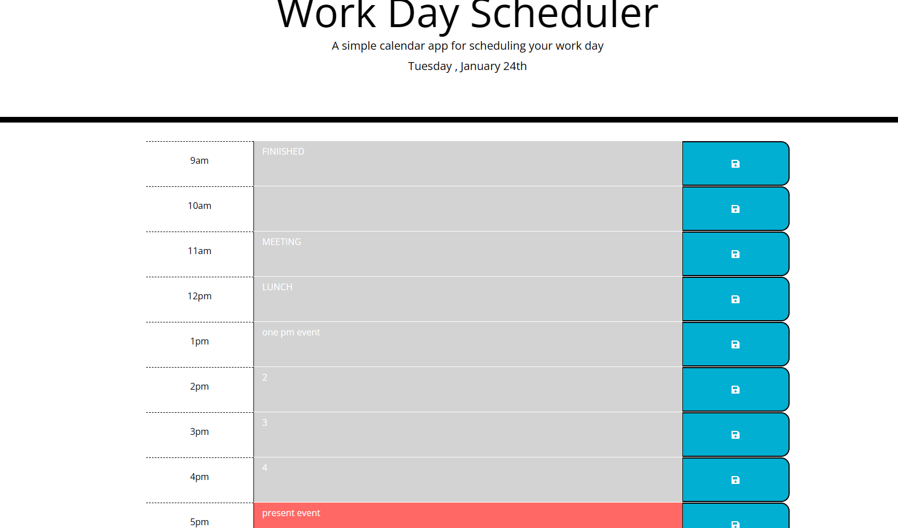

# Unit 7 Challenge: Daily planner app

## Overview

This project is used for planning and scheduling the daily itinerary.

## Project Details
In this application on the webpage header the current date will be displayed. The application will display the time from 9am to 5pm. User will be given a textarea to write their activites or schedule and a button to save the activites. Current hour will be displayed as red textarea. Past hours are displayed in grey textarea and future hours are displayed in green textarea.

## Installation

N/A

## License

Please refer to the license in the repo

## Credits

* https://www.tutorialrepublic.com/faq/how-to-set-value-of-textarea-in-jquery.php

* https://developer.mozilla.org/en-US/docs/Web/API/Element/click_event

* https://momentjs.com/docs/#/displaying/

## Deployed github link

*  https://github.com/Leonawesley/planner_app

*  https://leonawesley.github.io/planner_app/